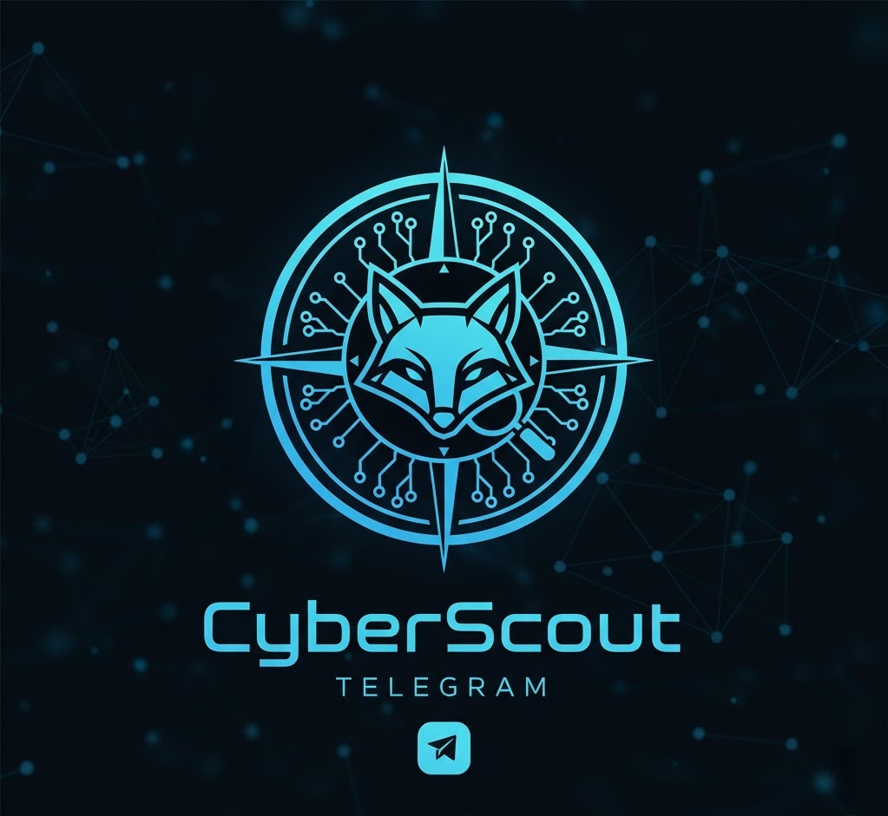

<div align="center">



# **CyberScout 🛰️**

### **Bot de Telegram para OSINT, Threat Intelligence y Ciberseguridad Ética**


<p align="center">
  <a href="#-características-principales">Características</a> •
  <a href="#-instalación">Instalación</a> •
  <a href="#-comandos-disponibles">Comandos</a> •
  <a href="#%EF%B8%8F-disclaimer">Legal</a>
</p>

---

</div>

**CyberScout** es un asistente avanzado de ciberseguridad diseñado para analistas SOC, pentesters, equipos de DFIR y entusiastas del hacking ético.

Permite realizar **OSINT**, validación de reputación, análisis de infraestructura web, escaneos seguros y consultas de vulnerabilidades (CVEs) directamente desde Telegram. **Fácil, rápido y centralizado.**

---

## 🚀 Características Principales

### 🔍 **OSINT y Reputación**
- **GeoIP & ASN:** Geolocalización, ASN y proveedor de IPs.
- **Dominios:** Consulta de registros DNS (A, NS) y WHOIS.
- **Reputación IP:** Verificación de confianza mediante **AbuseIPDB**.
- **Malware Hash:** Análisis de reputación de archivos en **VirusTotal**.

### 🌐 **Análisis Web**
- **Fingerprinting:** Detección heurística de tecnologías, CMS y frameworks.
- **Auditoría HTTP:** Análisis rápido de cabeceras de seguridad (Security Headers).
- **Cookies & Server:** Inspección de datos del servidor.

### 📡 **Infraestructura y Recon**
- **Nmap Scanner:** Escaneos rápidos de puertos comunes (Top 100/1000).
- **Cheatsheets:** Referencias rápidas de comandos Nmap y herramientas.

### 🔥 **Threat Intelligence & Blue Team**
- **CVE Lookup:** Información detallada de vulnerabilidades vía CIRCL API.
- **Playbooks:** Mini-guías defensivas para SOC/IR.
- **Rutas de Estudio:** Recursos para Pentesting, OSINT y DFIR.

---

## ⚙️ Requisitos Previos

- **Python 3.10+**
- **Sistema:** Ubuntu 22.04 /Linux en General (Recomendado) o Windows.
- **Herramientas base:** `nmap`, `whois`.
- **API Keys (Gratuitas):**
    - Telegram Bot Token (BotFather)
    - VirusTotal API Key
    - AbuseIPDB API Key

---

## 🚀 Instalación

### 1. Clonar el repositorio
```bash
git clone https://github.com/esteban11121/CyberScout.git
cd CyberScout
```

### 2. Instalación Automática (Recomendada)
Hemos incluido un script `setup.sh` que crea el entorno virtual, instala las dependencias y genera la plantilla del archivo de configuración.

```bash
chmod +x setup.sh
./setup.sh
```

> **Nota:** Si prefieres la instalación manual, crea el entorno virtual con `python3 -m venv venv`, actívalo e instala con `pip install -r requirements.txt`.

### 3. Configuración (.env)
Edita el archivo `.env` generado y agrega tus claves:

```bash
nano .env
```

Pegar el siguiente contenido:
```env
TELEGRAM_BOT_TOKEN=TU_TOKEN_TELEGRAM
VT_API_KEY=TU_API_KEY_VIRUSTOTAL
ABUSEIPDB_API_KEY=TU_API_KEY_ABUSEIPDB
```

### 4. Ejecutar el Bot
```bash
source venv/bin/activate
python CyberScout.py
```
_Salida esperada:_ `INFO:root:CyberScout iniciado.`

---

## 🤖 Comandos Disponibles

| Categoría | Comando | Descripción |
| :--- | :--- | :--- |
| **Sistema** | `/start` | Inicia el bot y verifica estado. |
| | `/help` | Muestra la ayuda y menú. |
| **OSINT** | `/osint_ip <ip>` | Geolocalización e info de IP. |
| | `/osint_domain <dominio>` | Registros DNS de un dominio. |
| | `/whois <host>` | Información de registro WHOIS. |
| **Reputación** | `/abuseip <ip>` | Reporte de confianza (AbuseIPDB). |
| | `/hash_info <hash>` | Análisis de hash (VirusTotal). |
| | `/ioc_check <valor>` | Análisis rápido de IOC. |
| **Web / Red** | `/webtech <url>` | Tecnologías usadas por una web. |
| | `/http_headers <url>` | Auditoría de cabeceras HTTP. |
| | `/nmap_scan <host>` | Escaneo de puertos (Scan seguro). |
| **Recursos** | `/cve <ID>` | Busca detalles de un CVE. |
| | `/nmap_cheatsheet` | Chuleta de comandos Nmap. |
| | `/blue_team` | Tips y Playbooks defensivos. |
| | `/learning_path` | Rutas de aprendizaje. |

---

## 🔧 Script de Instalación (`setup.sh`)

Si necesitas crear el archivo `setup.sh` manualmente, este es el contenido:

```bash
#!/usr/bin/env bash
set -e

echo "📦 Creando entorno virtual..."
python3 -m venv venv
source venv/bin/activate

echo "⬆️ Actualizando pip..."
pip install --upgrade pip

echo "📚 Instalando dependencias..."
pip install -r requirements.txt

if [ ! -f ".env" ]; then
  echo "🧾 Creando archivo .env..."
  cat > .env << 'EOF'
TELEGRAM_BOT_TOKEN=CAMBIAR_POR_TU_TOKEN
VT_API_KEY=CAMBIAR_POR_TU_API_KEY_DE_VIRUSTOTAL
ABUSEIPDB_API_KEY=CAMBIAR_POR_TU_API_KEY_DE_ABUSEIPDB
EOF
fi

echo "⚠️ Recordá editar .env antes de usar el bot."
echo "Para ejecutar: source venv/bin/activate && python CyberScout.py"
```

---

## 🤝 Contribuciones

Las contribuciones son bienvenidas. Para colaborar:
1. Haz un **Fork** del proyecto.
2. Crea una rama (`git checkout -b feature/mi-mejora`).
3. Envía un **Pull Request** con descripción de cambios y pruebas.

**Ideas futuras:**
- [ ] Integración con Shodan/Censys.
- [ ] Análisis de SSL/TLS.
- [ ] Reglas YARA offline.
- [ ] Upload de archivos para hashing automático.

---

## 🛡️ Disclaimer

> **⚠️ ADVERTENCIA LEGAL**
>
> **CyberScout** está diseñado únicamente para **fines educativos, de investigación y uso profesional autorizado**.
>
> * El autor no se responsabiliza por el uso indebido, escaneos no autorizados o violaciones de políticas.
> * El usuario es responsable de cumplir con las leyes locales y los términos de servicio de las APIs utilizadas (AbuseIPDB, VirusTotal, Telegram).

---

<div align="center">

### 📜 Licencia
Este proyecto está bajo la Licencia **MIT**.

**CyberScout** es tu asistente personal de ciberseguridad.
Si te sirve:
⭐ **¡Deja una estrella en el repo!**

*Happy Hunting (Ético) 🕵️‍♂️🛡️*


</div>
